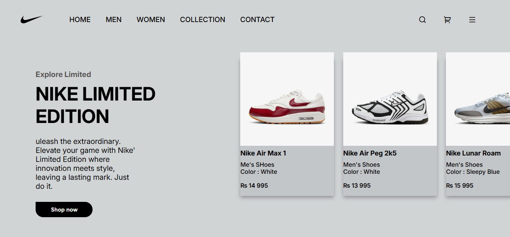

# 👟 Nike Limited Edition UI

A clean and responsive front-end layout for **Nike's Limited Edition** collection, built using **HTML** and **CSS**.

 <!-- Replace with your actual image path -->

## 📝 Description

This project replicates a modern e-commerce product showcase with a sleek, stylish interface for Nike's Limited Edition line. It focuses on responsive design, clean layout structure, and smooth product display using horizontal scrolling.

## 🚀 Demo

🔗 [Live Demo](https://kiracode.github.io/nike-website/) <!-- Replace with your live demo link -->

## 🛠️ Technologies Used

- **HTML5**
- **CSS3**
- **Flexbox for layout**
- **Google Fonts** (Inter, Poppins, Nunito)
- **RemixIcon** for icons

## ✨ Features

- Responsive navigation bar
- Smooth horizontal product scrolling
- Clean and modern typography
- Stylish buttons and UI components
- Minimalist color palette

## 📂 Folder Structure

nike-limited-edition-ui/
├── index.html
├── style.css
├── images/
│ ├── nike-logo-0.png
│ ├── air-max-1-lx-shoes.png
│ ├── air-peg-2k5-shoes.png
│ ├── lunar-roam-shoes.png
│ ├── nocta-glide-shoes.png
│ └── terminator-high-shoes.png
└── README.md

